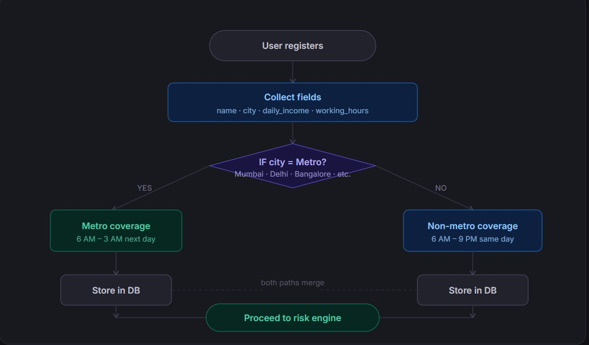
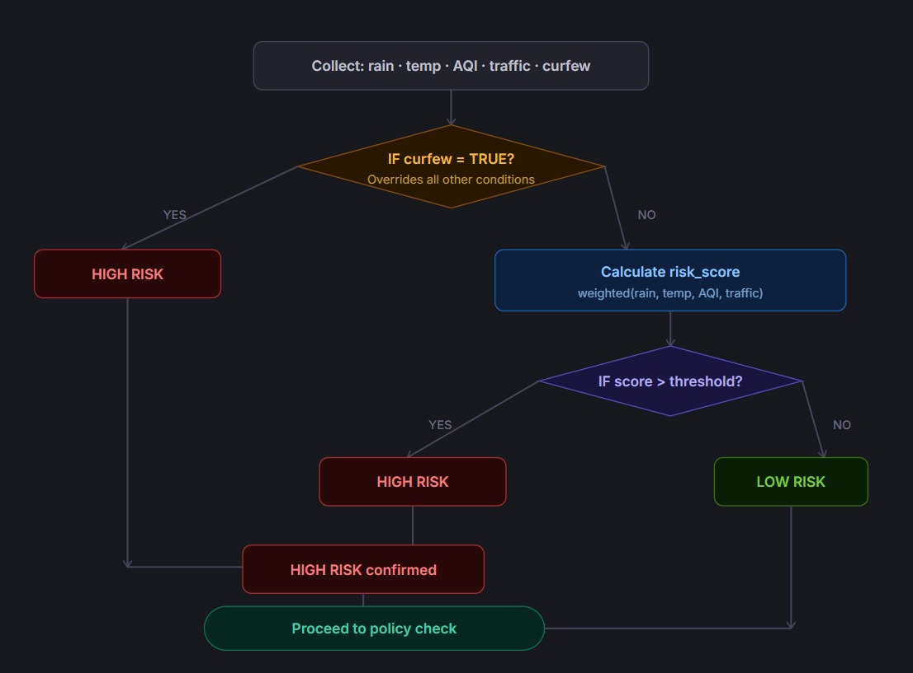
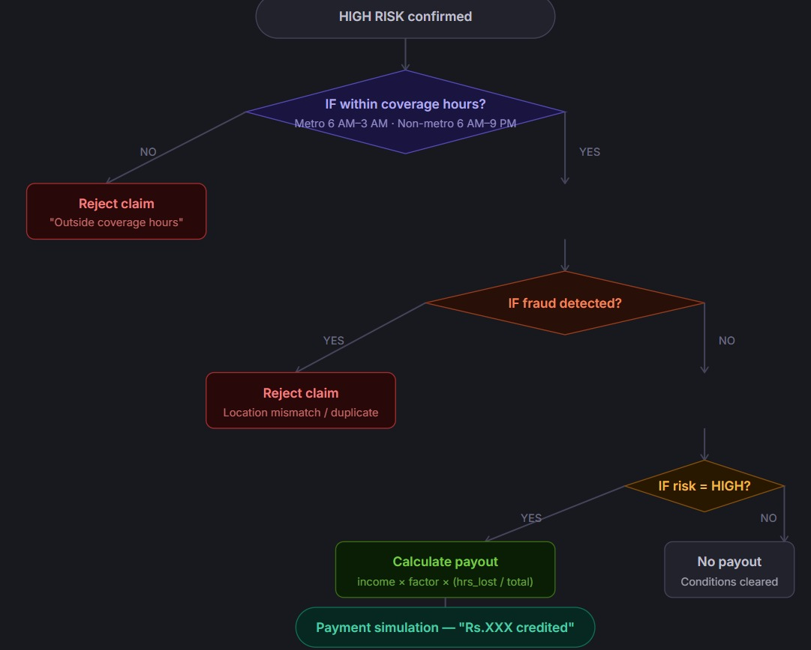
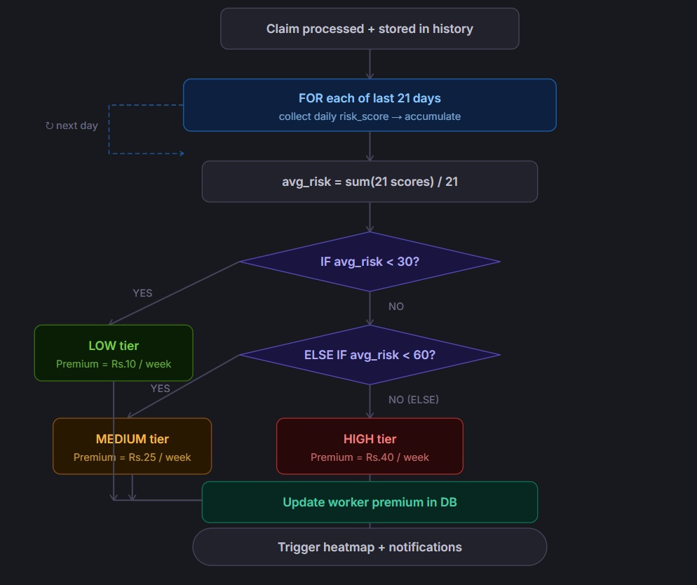

# Solution Workflow

1. Worker registers on the platform

2. System collects real-time data:
   - Weather
   - AQI
   - Traffic
   - Curfew

3. Risk Engine calculates risk score

4. Prediction Engine forecasts future risk

5. Smart Advisor suggests optimal working hours

6. System checks working-hour eligibility

7. Working Pattern Analyzer calculates overlap:
   - Working hours vs disruption time

8. Income loss is computed

9. If HIGH risk and valid conditions:
   - Fraud check is performed
   - Payout is calculated
   - Claim is triggered automatically

10. Worker receives notification:
   "₹420 credited due to disruption"

11. System updates:
   - Historical data
   - Risk heatmap
   - Premium pricing

